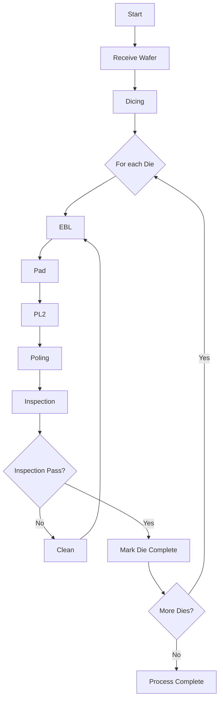

# Process Loop Summary (Future Agent Handoff)

## Purpose

This document captures the agreed **single-wafer process flow** and the reusable per-die loop behavior to use for future implementation work.

## Core Process Logic

We start with one wafer and process each die repeatedly through the same sequence until it is accepted.

1. **Wafer intake**
2. **Dicing**
3. For each die on that wafer:
   1. **EBL**
   2. **Pad**
   3. **PL2**
   4. **Poling**
   5. **Inspection**
   6. If the die fails inspection, run:
      - **Clean**
      - then return to **EBL**
   7. If inspection passes, mark die complete and proceed to next die.
4. Repeat die loop until all dies are complete.

## Flowchart

## Key Rule

The flow is a **stateful loop per die**:

- `Wafer -> Dicing -> Die-Loop`
- `Die-Loop: EBL -> Pad -> PL2 -> Poling -> Inspection`
- On inspection failure: `Clean -> EBL -> ...` (repeat loop)
- On inspection pass: advance to next die

## Future agent checklist

When continuing work, the next agent should implement exactly this behavior as the baseline:

1. Keep the flow as the canonical process definition.
2. Ensure dashboards and sequence displays use this ordered step list.
3. Treat each die as an independent loop iteration inside a single wafer assignment.
4. Keep repeating EBL only after clean/failed-inspection decision points.
5. Gate completion at die level, not wafer level.
6. Do not introduce unrelated schema changes without explicit approval.
